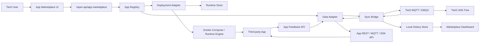

# Tier0 App Integration SDK

This SDK explains how to connect an open-source or third-party industrial application to Tier0 as a marketplace app. OpenEMS is the reference implementation, but the contract below is intentionally generic.

The SDK has two goals:

- Make a third-party app installable from the Tier0 App Marketplace.
- Make data move between Tier0 UNS/MQTT and that app in a repeatable, ISA95-aligned way.

A complete integration is more than a Docker container. It should provide marketplace metadata, a deployment adapter, launch and uninstall behavior, data input mappings, feedback mappings, UNS topic provisioning, and optional local history for dashboard views.

## Who Should Use This

Use this SDK when you want to add any app like these to Tier0:

- Energy systems: OpenEMS, EMS/BMS tools, battery controllers.
- SCADA or automation tools: Node-RED flows, PLC gateways, OPC UA adapters.
- Analytics apps: dashboards, optimizers, forecasting services.
- Custom services: your own Dockerized edge application.

## Current Implementation Status

The current production code is OpenEMS-first. It already proves the full path:

```text
Tier0 App Marketplace
  -> deploy OpenEMS by generated Docker Compose
  -> push Tier0 MQTT values into OpenEMS
  -> read OpenEMS feedback
  -> create/publish ISA95-shaped Tier0 UNS topics
  -> show live values and local history in the marketplace dashboard
```

The generic SDK contract is documented here so the next app does not need to copy OpenEMS-specific code. The intended extraction point is the provider interface in [`templates/app-marketplace-provider.ts`](./templates/app-marketplace-provider.ts), mirrored as a backend type contract at `frontend/apps/services-express/src/modules/app-marketplace/contracts.ts`.

## Reference File Map

OpenEMS currently lives in these files:

| Layer | Path | Responsibility |
| --- | --- | --- |
| Web UI manifest | `frontend/apps/web/src/pages/app-marketplace/manifest.ts` | App card, deployment fields, defaults |
| Web UI page | `frontend/apps/web/src/pages/app-marketplace/index.tsx` | Install modal, sync forms, feedback dashboard |
| Web UI compose preview | `frontend/apps/web/src/pages/app-marketplace/compose.ts` | Docker Compose preview and deployment spec |
| Web UI sync defaults | `frontend/apps/web/src/pages/app-marketplace/tier0-sync.ts` | Tier0 -> App and App -> Tier0 default mappings |
| Web API client | `frontend/apps/web/src/apis/inter-api/app-marketplace.ts` | Calls marketplace service APIs |
| Service route | `frontend/apps/services-express/src/routes/open-api/app-marketplace.ts` | Install, open, uninstall, sync API |
| Runtime helpers | `frontend/apps/services-express/src/modules/app-marketplace/runtime.ts` | Runtime files and deployment metadata |
| Data bridge | `frontend/apps/services-express/src/modules/app-marketplace/openems-sync.ts` | MQTT subscription, app REST reads/writes, UNS topic creation, local history |

For the next app, the OpenEMS-specific pieces should become app adapters rather than hard-coded route logic.

## Architecture



## Integration Levels

You do not need to implement everything on day one. Choose a level and grow from there.

| Level | Capability | Required work |
| --- | --- | --- |
| L0 | Static app card | Add manifest metadata only |
| L1 | Install/open/uninstall | Add deployment adapter and runtime metadata |
| L2 | Tier0 -> App | Subscribe to Tier0 MQTT/UNS values and write to app API |
| L3 | App -> Tier0 | Read app feedback and publish ISA95 topics to Tier0 MQTT |
| L4 | Dashboard/history | Store feedback samples and render cards/trends |
| L5 | Backend-driven marketplace | Load app cards from JSON/provider instead of hard-coded frontend manifest |

OpenEMS is currently L4.

## Core SDK Concepts

### 1. App Manifest

The manifest describes what appears in the App Marketplace. It should be pure metadata and default form configuration.

```ts
export interface MarketplaceAppManifest {
  id: string;
  name: string;
  description: string;
  version: string;
  status: 'install' | 'open';
  icon?: string;
  docsUrl?: string;
  launchUrl?: string;
  deployFields: AppDeployField[];
  defaultSync?: MarketplaceSyncConfig;
  dashboard?: MarketplaceDashboardDescriptor;
}
```

Required principles:

- `id` must be stable and URL/file-system safe, for example `openems` or `my-plc-gateway`.
- `deployFields` must contain everything needed to generate deployment config.
- The manifest should not execute Docker or call the app. It only describes the app.
- For future JSON-driven app cards, this manifest can be moved to a backend JSON file or remote provider.

### 2. Deployment Adapter

The deployment adapter converts user form values into runnable infrastructure.

```ts
export interface DeploymentAdapter<TParams = Record<string, string>> {
  appId: string;
  normalizeParams(input: Record<string, unknown>, context: DeploymentContext): TParams;
  buildDeployment(params: TParams, context: DeploymentContext): Promise<DeploymentPlan> | DeploymentPlan;
  deploy(plan: DeploymentPlan, context: DeploymentContext): Promise<DeploymentRecord>;
  uninstall(record: DeploymentRecord, context: DeploymentContext): Promise<void>;
  healthCheck?(record: DeploymentRecord, context: DeploymentContext): Promise<AppHealth>;
  resolveLaunchUrl(record: DeploymentRecord, context: DeploymentContext): string;
}
```

A deployment plan should include:

- `composeYaml`: generated Docker Compose YAML, if Docker Compose is used.
- `deploymentSpec`: structured services, ports, volumes, networks.
- `launchUrl`: browser URL for the app.
- `healthCheck`: optional URL or command to verify the app is alive.

OpenEMS uses Docker Compose, but a future adapter could use Kubernetes, Portainer API, a local process manager, or a pre-installed service.

### 3. Runtime Store

Every installed app needs a stable runtime directory. Current convention:

```text
frontend/apps/services-express/.runtime/app-marketplace/<appId>/
```

Recommended files:

```text
deployment.json                 # deployment metadata and launch URL
docker-compose.generated.yml     # generated compose file, if used
sync.json                        # bidirectional mapping config
feedback-history.json            # local dashboard history, optional
adapter-state.json               # app-specific state, optional
```

Runtime files are generated artifacts and must not be committed.

### 4. Data Adapter

The data adapter is the app-specific bridge. It knows how to write values into the app and read values back.

```ts
export interface AppDataAdapter<TTarget = AppDataTarget, TSource = AppDataSource> {
  appId: string;
  writeValue(target: TTarget, value: NormalizedValue, context: DataBridgeContext): Promise<AppWriteResult>;
  readValue(source: TSource, context: DataBridgeContext): Promise<AppReadResult>;
  subscribeToAppEvents?(context: DataBridgeContext): AsyncIterable<AppReadResult>;
}
```

Examples:

| App type | `writeValue` implementation | `readValue` implementation |
| --- | --- | --- |
| OpenEMS | REST channel write or JSON-RPC config update | REST channel read or JSON-RPC config read |
| MQTT-native app | MQTT publish to command topic | MQTT subscribe to telemetry topic |
| OPC UA adapter | OPC UA node write | OPC UA node read/subscribe |
| HTTP service | REST `POST /input` | REST `GET /metrics` |
| Node-RED flow | MQTT input topic or HTTP endpoint | MQTT output topic |

### 5. Sync Configuration

A sync config describes two directions:

- `inputMappings`: Tier0 -> App.
- `feedbackMappings`: App -> Tier0.

Generic shape:

```ts
export interface MarketplaceSyncConfig {
  appId: string;
  enabled: boolean;
  inputMappings: Tier0ToAppMapping[];
  feedbackEnabled: boolean;
  feedbackMappings: AppToTier0Mapping[];
}
```

OpenEMS still uses route names like `tier0-openems`; treat them as the first implementation of this generic sync config.

### 6. Tier0 -> App Mapping

Use this direction when Tier0 values should drive the external app.

```text
Tier0 MQTT/UNS value -> Sync Bridge -> AppDataAdapter.writeValue() -> App API
```

Generic fields:

| Field | Meaning |
| --- | --- |
| `tier0MqttUrl` | MQTT broker URL, usually `mqtt://emqx:1883` inside Docker |
| `tier0SourceType` | `alias`, `path`, or future `topic` |
| `tier0SourceValue` | Tier0 alias/path/topic to read |
| `tier0Field` | JSON field from payload, usually `value` |
| `targetType` | App-specific target type, e.g. `channel`, `config-property`, `mqtt-topic`, `http-endpoint` |
| `targetId` | App-specific target address |
| `valueType` | `number`, `boolean`, or `string` |
| `scale` / `offset` | Numeric transform before writing |
| `pollIntervalMs` | Fallback polling interval when live subscription is not enough |

Formula:

```text
targetValue = sourceValue * scale + offset
```

### 7. App -> Tier0 Feedback Mapping

Use this direction when the app should publish real feedback into Tier0.

```text
AppDataAdapter.readValue() -> Sync Bridge -> Tier0 MQTT publish -> UNS tree
```

Generic fields:

| Field | Meaning |
| --- | --- |
| `sourceType` | App-specific source type, e.g. `channel`, `config-property`, `mqtt-topic`, `http-endpoint` |
| `sourceId` | App-specific source address |
| `tier0TargetTopic` | Full Tier0 MQTT/UNS path |
| `tier0PayloadField` | Usually `value` |
| `valueType` | Expected value type |
| `scale` / `offset` | Numeric transform before publishing |
| `quality` | Optional source quality, default `GOOD` if value is valid |
| `isa95` | Structured ISA95 metadata used to build topic path |

## ISA95 Topic Convention

For app feedback, use this Tier0 topic shape:

```text
<Enterprise>/<Site>/<Area>/<Line>/<Cell>/<Asset>/<Category>/<Tag>
```

Recommended default categories:

| Category | Use for | Tier0 UI expectation |
| --- | --- | --- |
| `State` | current values and live state | visible in UNS tree |
| `Action` | commands or operations | action-oriented topics |
| `Metric` | numeric time-series values | useful for history/analytics |

For visibility in the current Tier0 UNS tree, prefer `State` topics for live feedback. If history is needed, also publish numeric `Metric` topics or keep local marketplace history.

Example:

```text
V1/Tier0Site/EnergyArea/OpenEMSLine/EdgeCell/OpenEMS/State/gridActivePower
```

## Feedback Payload Contract

A feedback payload should be predictable, typed, and debuggable.

Recommended shape:

```json
{
  "value": 242,
  "sourceValue": 242,
  "unit": "W",
  "quality": "GOOD",
  "timeStamp": "2026-05-15T02:30:00.000Z",
  "source": {
    "appId": "openems",
    "sourceType": "channel",
    "sourceId": "_sum/GridActivePower"
  },
  "metadata": {
    "description": "Grid active power",
    "appValueType": "INTEGER"
  }
}
```

Rules:

- `value` must match `valueType` after scale/offset.
- `timeStamp` must be ISO-8601 UTC.
- `quality` should be `GOOD`, `BAD`, or `UNKNOWN`.
- Keep app-specific metadata under `source` or `metadata`.
- Do not publish large raw app responses directly into `value`.

## Standard API Surface

Current implemented API:

| Method | Path | Purpose |
| --- | --- | --- |
| `GET` | `/open-api/app-marketplace/apps` | List marketplace apps |
| `GET` | `/open-api/app-marketplace/apps/:appId` | Get app detail/deployment |
| `POST` | `/open-api/app-marketplace/deploy` | Deploy app |
| `POST` | `/open-api/app-marketplace/apps/:appId/open` | Resolve launch URL |
| `DELETE` | `/open-api/app-marketplace/apps/:appId` | Uninstall app |
| `GET` | `/open-api/app-marketplace/apps/:appId/sync/tier0-openems` | Get OpenEMS sync config |
| `PUT` | `/open-api/app-marketplace/apps/:appId/sync/tier0-openems` | Save OpenEMS sync config |
| `POST` | `/open-api/app-marketplace/apps/:appId/sync/tier0-openems/run` | Run OpenEMS sync once |
| `GET` | `/open-api/app-marketplace/apps/:appId/sync/tier0-openems/history?limit=360` | Get local feedback history |

Proposed generic API for the next extraction:

| Method | Path | Purpose |
| --- | --- | --- |
| `GET` | `/open-api/app-marketplace/apps` | List apps from provider/registry |
| `GET` | `/open-api/app-marketplace/apps/:appId` | Get manifest, status, deployment, sync summary |
| `POST` | `/open-api/app-marketplace/apps/:appId/deploy` | Deploy one app using its adapter |
| `POST` | `/open-api/app-marketplace/apps/:appId/open` | Resolve launch URL |
| `DELETE` | `/open-api/app-marketplace/apps/:appId` | Uninstall one app |
| `GET` | `/open-api/app-marketplace/apps/:appId/sync` | Get generic sync config |
| `PUT` | `/open-api/app-marketplace/apps/:appId/sync` | Save generic sync config |
| `POST` | `/open-api/app-marketplace/apps/:appId/sync/run` | Run enabled mappings once |
| `GET` | `/open-api/app-marketplace/apps/:appId/history?limit=360` | Get local history samples |
| `POST` | `/open-api/app-marketplace/apps/:appId/topics/provision` | Provision UNS topics without running sync |

This generic API is the clean interface for your own App Market or any future remote marketplace provider.

## How To Use Your Own App Market

There are three practical ways to use a custom App Market with Tier0.

### Option A: Use Tier0 UI, add app manifests locally

Best for early development.

1. Add a manifest entry in `frontend/apps/web/src/pages/app-marketplace/manifest.ts`.
2. Add deploy fields and i18n labels.
3. Add a deployment adapter in `services-express`.
4. Add sync defaults if the app exchanges data.
5. Rebuild frontend and restart via the project install/update logic.

Pros: fastest path.  
Cons: app cards are still compiled into frontend code.

### Option B: Use Tier0 UI, load apps from backend provider

Best next step for a reusable SDK.

1. Move app metadata to backend JSON or database.
2. Implement `AppMarketplaceProvider` from [`templates/app-marketplace-provider.ts`](./templates/app-marketplace-provider.ts).
3. Change `GET /open-api/app-marketplace/apps` to return provider data.
4. Keep the current UI card renderer; it can render any app returned by the provider.

Pros: new apps can be added by JSON/config.  
Cons: requires small backend refactor.

### Option C: Use your own marketplace frontend

Best if you already have a separate app-market product.

1. Keep Tier0 `services-express` as the deployment/data bridge backend.
2. Your frontend calls the generic API listed above.
3. Your app market sends `DeployRequest`, `SyncConfig`, and `OpenApp` calls to Tier0.
4. Tier0 still owns Docker/network/runtime state and UNS/MQTT publishing.

Pros: your marketplace controls the UI.  
Cons: your frontend must follow the Tier0 API contract.

## JSON-Driven App Cards

Target shape for a config-driven app card:

```json
{
  "id": "my-app",
  "name": "My App",
  "description": "Deploy My App and connect it to Tier0.",
  "version": "1.0.0",
  "icon": "apps",
  "docsUrl": "https://example.org/docs",
  "adapter": "docker-compose",
  "deployFields": [
    {
      "key": "image",
      "label": "Container Image",
      "type": "text",
      "defaultValue": "example/my-app:latest",
      "required": true
    },
    {
      "key": "httpPort",
      "label": "HTTP Port",
      "type": "number",
      "defaultValue": "18090",
      "required": true
    }
  ],
  "sync": {
    "enabled": false,
    "inputMappings": [],
    "feedbackMappings": []
  }
}
```

The UI should not need custom code for simple apps if the backend returns this shape.

## Adding A New App

Use this sequence:

1. Discover the app runtime: image, ports, volumes, network, health check.
2. Discover the app data API: how to write commands/measurements and read feedback.
3. Define ISA95 placement: Enterprise, Site, Area, Line, Cell, Asset, Category, Tag.
4. Add a manifest.
5. Add deployment adapter.
6. Add data adapter.
7. Add default sync config.
8. Add feedback topics and payload schema.
9. Add dashboard descriptors if live values should be visible in marketplace.
10. Verify install, open, data input, feedback, UNS tree, and uninstall.

Use [`templates/adapter-checklist.md`](./templates/adapter-checklist.md) as the execution checklist.

## OpenEMS Verification Flow

1. Start Tier0 using project install logic, not a standalone compose-only path.
2. Open Tier0, go to UNS, then App Marketplace.
3. Open the OpenEMS card.
4. Keep default ports unless occupied:
   - Edge Felix: `18080`
   - Edge REST API: `18084`
   - Edge WebSocket: `18085`
   - UI HTTP: `18081`
5. Click Install.
6. Enable `Tier0 -> OpenEMS` if Tier0 values should drive OpenEMS simulated consumption.
7. Enable `OpenEMS -> Tier0 ISA95 Feedback` for feedback.
8. Save sync.
9. Click Run Sync Now or wait for polling.
10. In UNS, inspect:

```text
V1/Tier0Site/EnergyArea/OpenEMSLine/EdgeCell/OpenEMS/State
```

11. In the marketplace dashboard, use the metric selector and `Hide zero/empty values` switch to control visible feedback cards.

## What Should Be Extracted Next

The current implementation proves the use case but still contains OpenEMS-specific names. The next SDK refactor should extract:

- `AppManifestRegistry`
- `AppMarketplaceProvider`
- `DeploymentAdapter`
- `AppDataAdapter`
- `SyncConfigStore`
- `FeedbackPublisher`
- `Isa95TopicBuilder`
- `RuntimeStore`
- `MarketplaceRouterFactory`

The main extension point should be:

```ts
registerMarketplaceApp({
  manifest,
  deploymentAdapter,
  dataAdapter,
  dashboardAdapter,
});
```

After this extraction, adding a new app should be mostly config plus one adapter module, not changes across the page, route, runtime, and sync manager.
